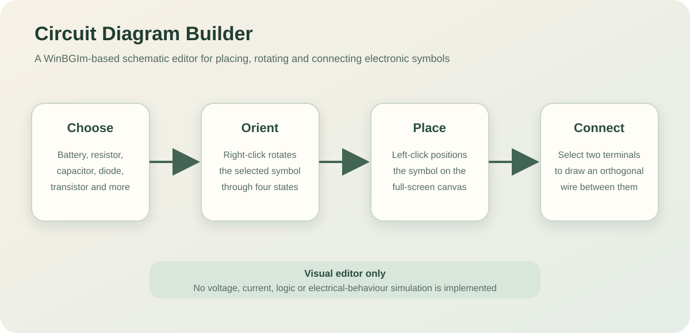
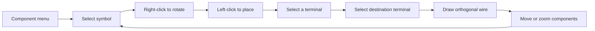
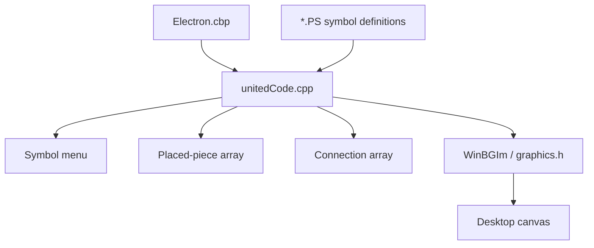

# Circuit Diagram Builder

**A C++/WinBGIm desktop prototype for arranging and connecting electronic schematic symbols on a graphical canvas.**

<p align="center">
  
</p>

<p align="center">
  
  
  
  
  
</p>

## Overview

Circuit Diagram Builder—internally titled **Electron**—is an educational desktop application for constructing schematic diagrams. Users select electronic symbols from a menu, rotate and position them, then connect their terminals with routed lines.

The project focuses on graphical editing and interaction. It does **not** simulate current, voltage, logic states or electrical behaviour.

## What the application supports

- Full-screen WinBGIm graphical interface.
- Menu of reusable electronic symbols.
- Data-driven symbol descriptions loaded from `.PS` files.
- Placement of multiple instances on a drawing canvas.
- Four-way symbol rotation.
- Connection points attached to symbols.
- Orthogonal wire drawing between terminals.
- Automatic creation of an intermediate node when a connection ends away from an existing terminal.
- Moving already placed components.
- Zooming symbols in and out.
- Audible feedback for editing actions.
- Debug and release targets in a Code::Blocks project.

## Included component types

The Code::Blocks project includes definition files for:

| Definition file | Intended symbol |
|---|---|
| `AMPLOP.PS` | Operational amplifier |
| `BATERIE.PS` | Battery |
| `CONDENS.PS` | Capacitor |
| `DIODA.PS` | Diode |
| `NOD.PS` | Connection node |
| `POLARIZ.PS` | Polarised component/source |
| `REZIST.PS` | Resistor |
| `SERVOMOT.PS` | Servo motor |
| `SINU.PS` | Sinusoidal source |
| `STOP.PS` | Stop/indicator component |
| `TRANZNPN.PS` | NPN transistor |
| `TRANZPNP.PS` | PNP transistor |
| `ZENNER.PS` | Zener diode |

The labels are inherited from the original Romanian implementation.

## User workflow



### Place a component

1. Open the create/editor view.
2. Left-click a component in the menu.
3. While positioning it, right-click to rotate it.
4. Left-click the canvas to place it.

### Connect components

1. Left-click near a connection point on a placed component.
2. Move the pointer; the application previews a routed line.
3. Left-click a connection point on another component.
4. The connection is stored and rendered.

When the destination does not match an existing component terminal, the current implementation may add a node at the clicked position.

### Move a component

Right-click near an already placed component, then reposition it through the placement workflow.

### Zoom

- Double right-click: increase symbol zoom.
- Double left-click: decrease symbol zoom.

The zoom operation redraws existing pieces at the new scale.

## Architecture



## Data model

The single source file defines compact C-style structures:

### `piesa` — component instance

Stores:

- numeric identifier;
- instance frequency/count;
- name and display content;
- canvas position;
- orientation;
- connection points;
- a drawing description.

### `descriere` — drawing instructions

Stores a command list and coordinate pairs. Symbol-definition files are loaded into this structure and rendered through primitives such as lines and rectangles.

### `legatura` — connection

Stores:

- the two component/node identifiers;
- the selected terminal index on each endpoint;
- a connection type field reserved for future use.

### Fixed-capacity storage

The implementation uses fixed-size global arrays for menu entries, placed pieces, nodes and connections. This keeps the introductory-programming implementation straightforward but places hard limits on document size.

## Repository structure

```text
Circuit-Diagram-Builder/
├── Electron/
│   ├── Electron.cbp                 # Code::Blocks project
│   ├── unitedCode.cpp               # Application source
│   ├── *.PS                         # Component drawing definitions
│   ├── bin/
│   │   ├── Debug/
│   │   └── Release/
│   └── obj/                         # Generated object files
├── docs/
│   └── editor-workflow.svg
├── LICENSE
└── README.md
```

## Recommended platform

The application is strongly Windows-specific because it uses:

- `winbgim.h`;
- `graphics.h`;
- Windows mouse event constants such as `WM_LBUTTONDOWN`;
- `GetSystemMetrics`;
- `Beep`;
- a Code::Blocks GNU compiler configuration.

The most reliable path is Windows with Code::Blocks and a correctly configured WinBGIm toolchain.

## Build with Code::Blocks

### Prerequisites

- Windows.
- Code::Blocks with a MinGW/GCC compiler.
- WinBGIm headers and libraries configured for that compiler.

### Steps

```bash
git clone https://github.com/Machine-Learning-Compatible-Game-Engine/Circuit-Diagram-Builder.git
```

Then:

1. Open `Electron/Electron.cbp` in Code::Blocks.
2. Confirm that `winbgim.h` and `graphics.h` are visible to the compiler.
3. Confirm that the required BGI libraries are linked by the Code::Blocks toolchain configuration.
4. Select the `Debug` or `Release` target.
5. Build and run.

The project declares:

- Debug output: `Electron/bin/Debug/Electron prof.exe`
- Release output: `Electron/bin/Release/Electron prof.exe`

The component `.PS` files must remain available in the working directory expected by the executable because the application opens them by relative filename.

## Run the committed Windows executable

A historical debug executable is stored at:

```text
Electron/bin/Debug/Electron prof.exe
```

Run executables committed to source repositories only after reviewing their provenance. Building from source is preferable.

## Why a direct Linux build is not currently portable

The previous README suggested compiling the source with GCC on Linux. In practice, ordinary Linux GCC is insufficient because the program depends on Windows APIs and WinBGIm-specific event handling.

A portable Linux version would require replacing or abstracting:

- WinBGIm drawing and window management;
- Windows mouse constants;
- screen-size detection;
- sound feedback;
- executable and project configuration.

Suitable replacement options could include SDL2, SFML, raylib or Qt.

## Symbol-definition format

Each component is loaded from a file named after its internal symbol name with a `.ps`/`.PS` extension. The current parser reads:

1. symbol name;
2. number of connection points;
3. coordinates for each terminal;
4. display content;
5. number of drawing commands;
6. command letters and coordinate pairs.

This allows symbols to be changed without recompiling the C++ source, but the format is positional and undocumented beyond the parser.

A future schema should define:

- formal command names;
- versioning;
- validation errors;
- coordinate units;
- supported primitives;
- arbitrary terminal counts;
- metadata such as category and electrical type.

## Current rendering model

The editor uses immediate drawing calls and redraws pieces manually. Rotations transform each stored point through repeated 90-degree coordinate changes. Connections are displayed as three orthogonal line segments:

```text
endpoint A → horizontal midpoint → vertical segment → endpoint B
```

This keeps wires visually structured without implementing a full routing algorithm.

## Known limitations

- No electrical simulation.
- No circuit-rule validation.
- No voltage/current/source model.
- No undo/redo system.
- Fixed-size arrays cap the number of pieces and connections.
- The entire application is concentrated in one large source file.
- Global mutable state is used throughout.
- File parsing lacks robust error handling and schema validation.
- The code assumes every definition file exists and is correctly formatted.
- Symbol rotation logic duplicates transformations for each drawing primitive.
- Wire routing is only midpoint-based and does not avoid obstacles.
- Connections do not automatically follow all component moves reliably without a more explicit graph/redraw model.
- The connection type field is unused.
- Windows-specific APIs prevent a straightforward Linux build.
- Generated object files and executables are committed.
- There is no automated test suite or CI build.
- Existing binaries may not run on every modern Windows environment.

## Recommended next steps

1. Separate model, rendering, input and persistence code into modules.
2. Introduce dynamic containers such as `std::vector`.
3. Define and validate a versioned component-description format.
4. Replace WinBGIm with a maintained cross-platform UI or graphics framework.
5. Add a scene graph where wires reference component terminal identifiers.
6. Recompute wire endpoints whenever a component moves or rotates.
7. Add selection, deletion, undo and redo.
8. Add save/load using a documented project format.
9. Add grid snapping and obstacle-aware wire routing.
10. Treat simulation as a separate subsystem after the editor model is reliable.
11. Remove generated binaries and build artefacts from version control.
12. Add screenshots from a freshly built version and automated Windows builds.

## Project context

The project originated in an introductory university programming course. Its main value is demonstrating how a graphical editor can be assembled from basic structures, file parsing, mouse events, geometry transformations and drawing primitives.

## Licence

The repository contains a GNU General Public License v3.0 licence. Redistribution and derivative work must comply with that licence.
